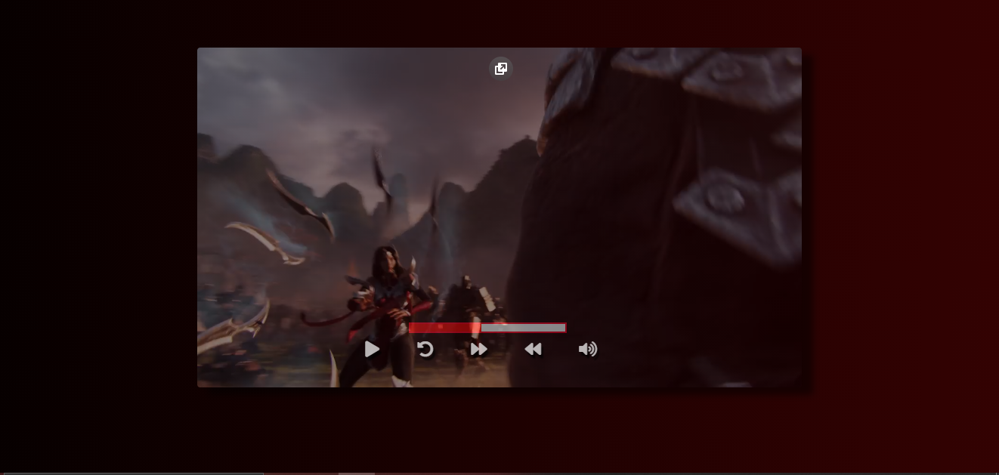

<h1 align='center'>
    Video Controls
</h1>

# ✨ Previw
<h2>
    
    
</h2>

# 📝 Sobre

O projeto **Video Controls** é um site onde você tem um reprodutor de vídeo, no qual os controles do vídeo estão customizados, ele consta com os botões de play/pause, mute, reload e os botões de avançar ou voltar 10 segundos, além do progressor que mostra em qual tempo o vídeo ta.

## 💻Tecnologias utilizadas

- [HTML5](https://developer.mozilla.org/pt-BR/docs/Web/HTML/HTML5)
- [CSS3](https://www.w3.org/Style/CSS/Overview.en.html)
- [JavaScript](https://www.javascript.com/)

## ▶ Como acessar

Acesse o site: https://gabrielduete.github.io/videoControls1/
